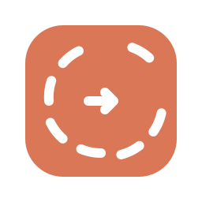

# Claude Action Ring



Eight Claude Desktop Code-tab actions for the Logitech MX Master 4 for Mac Actions Ring.
Developed by **xianwei zhang**. Independent integration; not built, endorsed or supported by Anthropic or Logitech.

## Install

Requires macOS, Claude Desktop (Code tab), Logi Options+ with plugin support, and MX Master 4 for Mac.

1. Download the latest `ClaudeActionRing_<version>.lplug4` from Releases and open it to install.
2. In Options+, select Claude Action Ring and assign the eight actions to the eight ring slots.
3. Keep Claude Desktop frontmost with the Code tab active. The actions send Claude's own documented Code-tab shortcuts, so they do nothing useful on the Chat or Cowork tabs.

| Action | Delivery |
| --- | --- |
| Permission Mode | Command–Shift–M |
| Model | Command–Shift–I |
| Effort | Command–Shift–E |
| Side Chat | Command–; |
| Toggle Diff | Command–Shift–D |
| Toggle Terminal | Control–` |
| View Mode | Control–O |
| Next Session | Control–Tab |

Shortcut availability depends on your Claude Desktop version; the mapping follows the [Code tab keyboard shortcuts](https://code.claude.com/docs/en/desktop#keyboard-shortcuts) reference.

## Build and test

Use the .NET 10 SDK and the PluginApi.dll installed by Logitech's plugin service. The SDK is referenced locally and is not bundled in this repository. Python 3 is used for packaging and validation; icon generation also requires librsvg (`rsvg-convert`) and Pillow.

```sh
dotnet build ClaudeActionRingPlugin/ClaudeActionRingPlugin.sln -c Release
python3 -m unittest discover -s ClaudeActionRingPlugin/tests/Contracts -v
python3 -m unittest discover -s ClaudeActionRingPlugin/tests/IconSystem -v
```

Run each .NET test project under `ClaudeActionRingPlugin/tests/` with `dotnet test <project.csproj>`.
See [icons](ClaudeActionRingPlugin/tools/icons/README.md), [packaging](ClaudeActionRingPlugin/tools/package/README.md) and [validation](ClaudeActionRingPlugin/tools/validate/README.md) for the icon pipeline and the official LogiPluginTool workflow. Release versions are immutable; choose a new version when preparing a new package.

## Privacy and support

The plugin only sends local keyboard shortcuts to Claude Desktop while it is the frontmost application. It does not read prompts, files, clipboard or audio and has no analytics or network client. Local diagnostic logs contain only the plugin version and anonymous error categories.

Report bugs through [GitHub Issues](https://github.com/semantic-craft/logi-claude/issues). Do not include private prompts, credentials or account details.

## License

Developer-owned code and icon assets are available under the [MIT License](LICENSE). Logitech SDK components and third-party trademarks retain their respective rights; no Logitech SDK binaries are included. Claude is a trademark of Anthropic, PBC.
